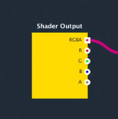
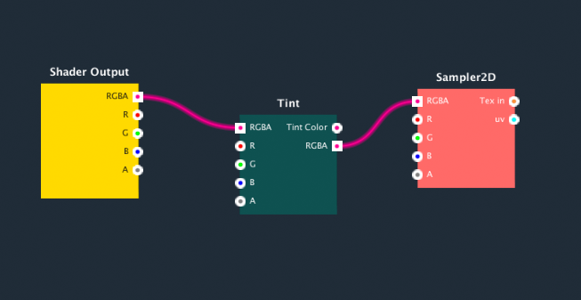

**2D Effects Shader Editor** is a node-based shader editor. You can create shader by connecting nodes with wires. It is a visual editor and no coding is needed. There is a core node called _“Sprite Shader”_ in each graph. This node specifies the features supported in the shader represent by this graph.

Sprite Shader Node

 

_“Sprite Shader”_ node have an input RGBA, this specify the final output color of the shader. You can connect RGBA output port from other node to specify the output color of the shader.

Figure above is a graph show a simple shader for adjusts tint color. _“Sampler 2D”_ node represent the color input from the sprite texture. We connect the output RGBA to the “Tint” node’s RGBA input. The “Tint” node add the function to adjust the color from the input texture. Then the output RGBA is connect to RGBA port of the “Sprite Shader” node and set the final color of  the shader.

This is the basic concept of the shader editor. Connecting nodes and specify the data flow by wire them. Then, the editor compiles the graph as a shader.