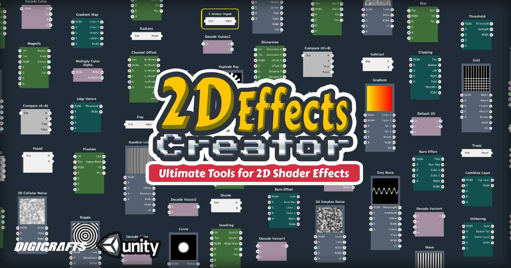

[1. Introduction](https://github.com/digicrafts/2DFXShaderEditor/wiki/Introduction)

[2. Installation](https://github.com/digicrafts/2DFXShaderEditor/wiki/Installation)

[3. Basic Concepts](https://github.com/digicrafts/2DFXShaderEditor/wiki/Basic-Concepts)

[4. User Interface](https://github.com/digicrafts/2DFXShaderEditor/wiki/User-Interface)

[5. Mouse Keyboard Shortcuts](https://github.com/digicrafts/2DFXShaderEditor/wiki/Mouse-Keyboard-Shortcuts)

[6. Quick Start](https://github.com/digicrafts/2DFXShaderEditor/wiki/Quick-Start)

[7. Node's Wiki](https://github.com/digicrafts/2DFXShaderEditorNodes/wiki/Introduction)