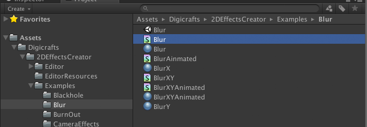

1. Download and import the **2D Effects Shader Editor** from Asset Store.

2. The plug-in is located in Digicrafts/2DEffectsShaderEditor.

 

3. You can find examples in the folder Digicrafts/2DEffectsShaderEditor/Examples.

4. Installation is complete. To verify the installation, open an example file, select Examples/Blur/Blur.shader.

5. Open **2D Effects Shader Editor** from menu Window>2D Shader Editor.

6. You should see a node graph look like below figure. That means installation is success.

