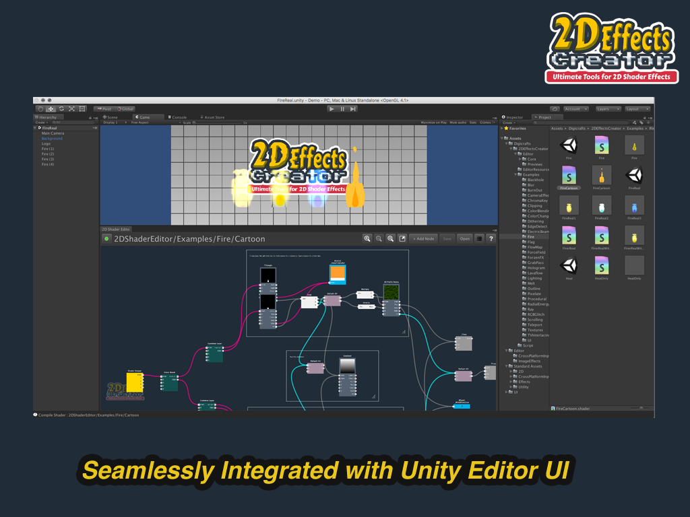

**2D Effects Creator** is a node-based shader creation tool for creating 2D shader effect that work with 2D sprite and Unity UI. It is tightly and seamlessly integrated with Unity’s UI. This integrated solution provides a familiar and consistent development environment for your shader creation workflow.

Flexible and powerful node-based system let you create AAA quality 2D effect without writing any code. The shaders works without **2D Effects Creator** installed.

**2D Effects Creator** provides plenty of nodes range from basic operators to special color and distortion effects. This selection of nodes allows you to create shader effect with maximum creativity. The package also comes with plenty of examples to kick-start your learning.

**Highlighted Features**

- Node-based 2D shader effect editor
- Easy, clean and integrated UI
- Suitable for beginner to pro user
- 40+ Color and distort effects
- 20+ Procedural shapes
- 100+ Basic operator and logic nodes
- Pure shader animation
- Support unlit and surface shader
- Included Camera effects helper script
- Work with 2D Sprite and Unity UI
- One-click shader save and update
- Keyboard Shortcuts
- Produce independent shader* works without 2D Effects Creator installed
- Tested on Unity 5.4, 5.5 and 5.6

(*SpriteHelper script needed for shaders to work with multiple sprite atlas. The script is included)