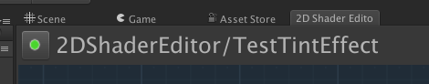
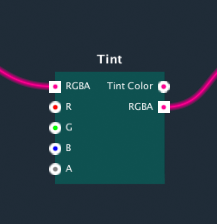
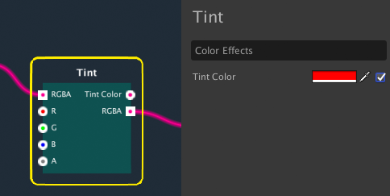
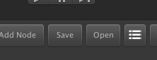
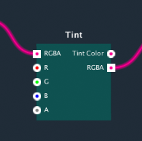

In this guide, you can learn the basic steps to create shader using **2DFX Shader Editor** and the steps for using it on your scene object.

1.	Create the shader file. From the main menu or right click on the project window, select **Assets>Create>Shader>2DFX**.

  

2.	Edit the shader name. Open **2DFX Shader Editor** from **window>2DFX Shader Editor**. From the editor, select and edit the shader name.

 

3.	Add a node. Open the create node context menu by click the create button or “N” shortcut key. 

 

4.	Select the **"Color Effects>Tint"**. A tint effect node is created on the graph.

  

5.	Connect the node. Drag and drop from the “RGBA” port of Sprite Shader node to “RGBA” port of  Tint Effect node.

  

6.	Drag and drop from the “RGBA” port of Tint Effect node to “RGBA” port of  Sampler2D node.

  

7.	Select the Tint Effect node and open the node properties (“D” key”). Enable the toggle next to the Color property to make the property become dynamic. 

  

8.	Save and compile. The graph is look below. Click the “Save” button to compile and save.

  

9.	Create a material from **Assets>Create>Material**. Select the material and choose the created shader from the list. The material is ready to use.

 