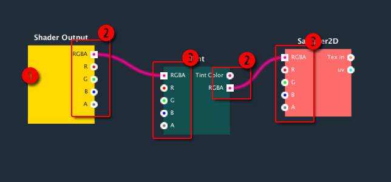

You can open the **2DFX Shader Editor** from menu _"window>2DFX Shader Editor"_. The ******2DFX Shader Editor****** only work when you select a 2DFX shader.

**Shader Editor**

| No.	| Part Name	| Description |
|--------------------------|----------------------------------------|----------------------------------------|
| 1	| Canvas	| The active area for placing the node and wire. You can drag and drop the node and create new node or connect the port on node within the graph. |
| 2	| Node properties inspector	| Show the properties of each node when selected. Toggle the inspector with show/hide button (7). |
| 3	| Change Indicator 	| Indicate if the shader is ready. Red icon means the shader is changed and need to save. Green icon means the shader is saved and ready. |
| 4	| Shader name 	| Show and edit the shader name in this text input box. |
| 5	| Zoom buttons	| Control the zoom level of the node graph with the zoom in/out button. Or reset the zoom level with reset button. |
| 6	| Create node button	| Create a new node with this button. A context menu show available nodes when click on the button. |
| 7	| Save button	| Save the shader with this button.  |
| 8	| Open shader button 	| Open the shader file in external editor. |
| 9	| Node properties toggle button	| Toggle to show/hide the node properties. |
| 10	| Help button	| Toggle the help manual window. |

**Nodes**

| No.	| Part Name	| Description |
|--------------------------|----------------------------------------|----------------------------------------|
| 1	| Node	| Each node represents a function, property, operator, etc. The header shows the name of the node. User can drag and drop the node within the graph. |
| 2	| Input ports	| The input ports are located at the right side of the node. This allow data flow in the node. |
| 3	| Output ports 	| The output ports are located at the left side of the node. This allow data flow out the node. |
| 4	| Connection wire	| The connection wire connect the port between node. You can create wire by drag and drop from a input port to a output port. |

**Node properties inspector**

| No.	| Part Name	| Description |
|--------------------------|----------------------------------------|----------------------------------------|
| 1	| Properties label	| The name/description of the property. |
| 2	| Properties value	| Set the value of the property. It will be the default value of the property if this property it dynamic. |
| 3	| Dynamic toggle 	| The property will be a dynamic property if set. You can change the property in the shader inspector or by script. |

