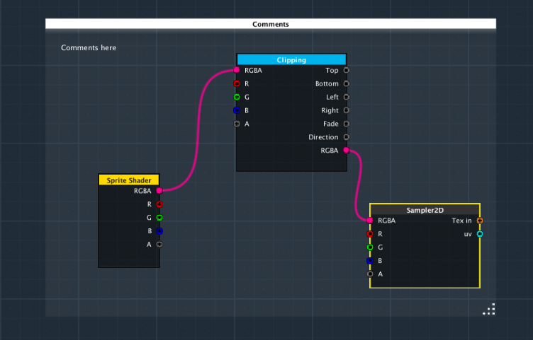
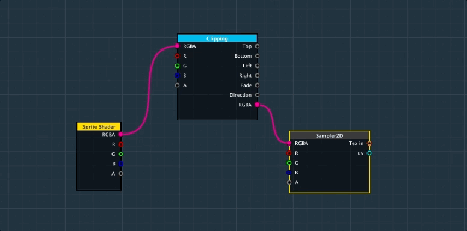
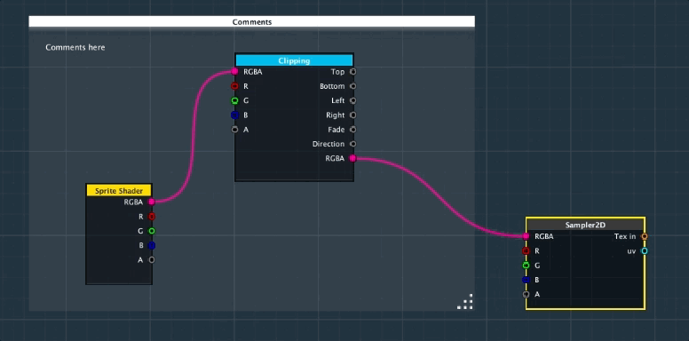

When a shader being complex, the number of nodes may increase and make the graph not easy to read. **2D Effects Creator** provide a simple and useful node to manage the nodes - _comments node_. You can group several nodes in the comments node and add comments on it.

You can add a new _comments node_ from node menu **Utilities>Comments Node**.  Resize the comments node by drag on the bottom-right corner.

By drag and drop the nodes inside the comments node, you can group several nodes together and move all nodes.

