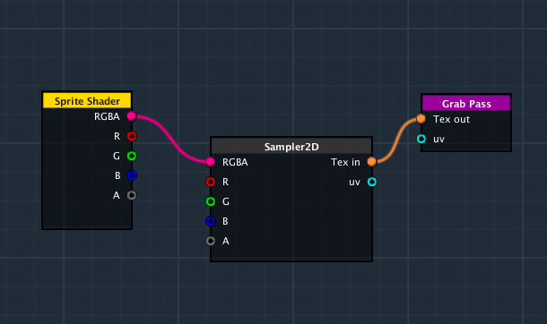
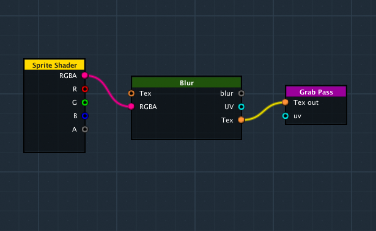

GrabPass is a special pass type - it grabs the contents of the screen where the object is about to be drawn into a texture. This texture can be used in subsequent passes to do advanced image based effects.

**2D Effects Shader Editor** provide a GrabPass node which allow the shader to work with GrabPass. The GrabPass node provide a tex output which acts like normal texture node. You can sampler the tex using a Sampler2D node or use directly with nodes which support tex input.

To use GrabPass with Sampler2D node. Connect the tex output to the Sampler2D node's tex input port. In the graph below, the shader will copy the screen and and output the sampled color to shader ouput color. 

To use GrabPass with nodes that support tex input. Connect the tex output to the node supporting tex input. This will acts like normal texture input and you can apply effect on it. In the graph below, it will take screenshot and apply blur effect on it.

