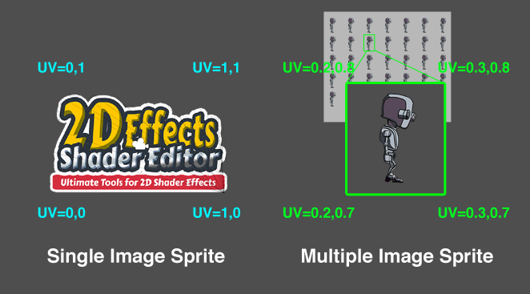

Unity provide a [**Multiple Sprite Mode**](https://docs.unity3d.com/Manual/SpriteEditor.html) in using sprite image. It allows multiple images combined into a single image. But the UV coordinate is different from the normal single image sprite. Some effects which base on uv coordinate may be have problem (e.g. clipping effect will clip image base on UV).

**2D Effects Shader Editor** provide a workaround for this situation. It provide a option to calcaulate the correct uv. Ana provide a c# script to work with the situation.

To use with Mutiple Sprite, you can enable the **Mutiple Sprite Mode** in the shader node option. 

Then, attach the provided **SpriteHelper.cs** to the GameObject which using the sprite.

