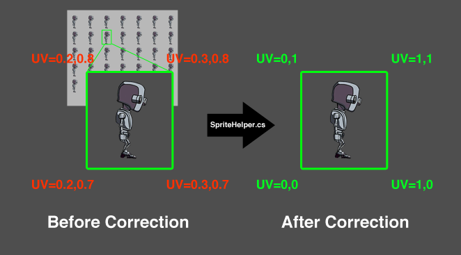

Unity provide a [**Multiple Sprite Mode**](https://docs.unity3d.com/Manual/SpriteEditor.html) in using sprite image. It allows multiple images combined into a single image. Some effects such as clipping effect will clip image base on UV. But the UV coordinate in multiple sprite mode is differ from the normal single image sprite and lead to incorrect effect.

**2D Effects Creator** provide a workaround for this situation. It provide an option to calcaulate the correct uv. By enable the option and using the included c# script (SpriteHelper.cs), it will pass the correct uv in multiple sprite mode.

To use with Mutiple Sprite, you can enable the **Mutiple Sprite Mode** in the shader node option. 

Then, attach the provided **SpriteHelper.cs** to the GameObject which using the sprite.

When running the game, the script will calculate the corrected uv and pass to the shader.